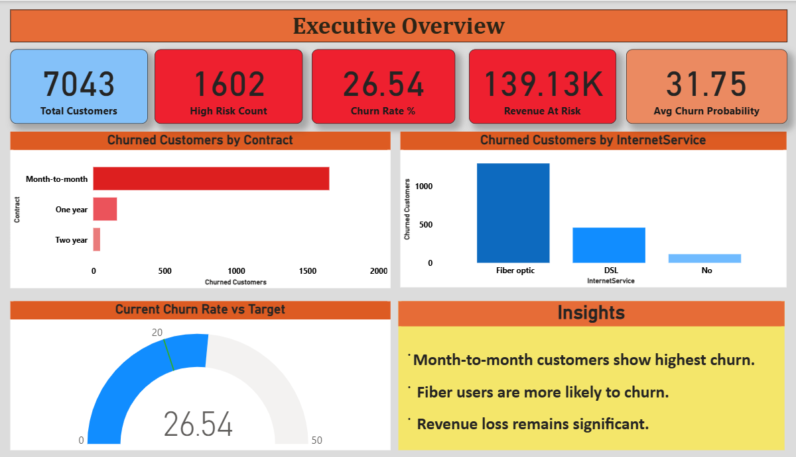
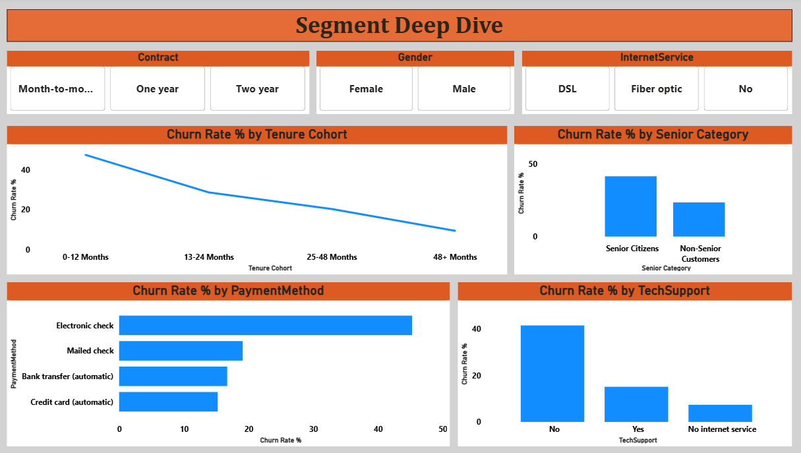
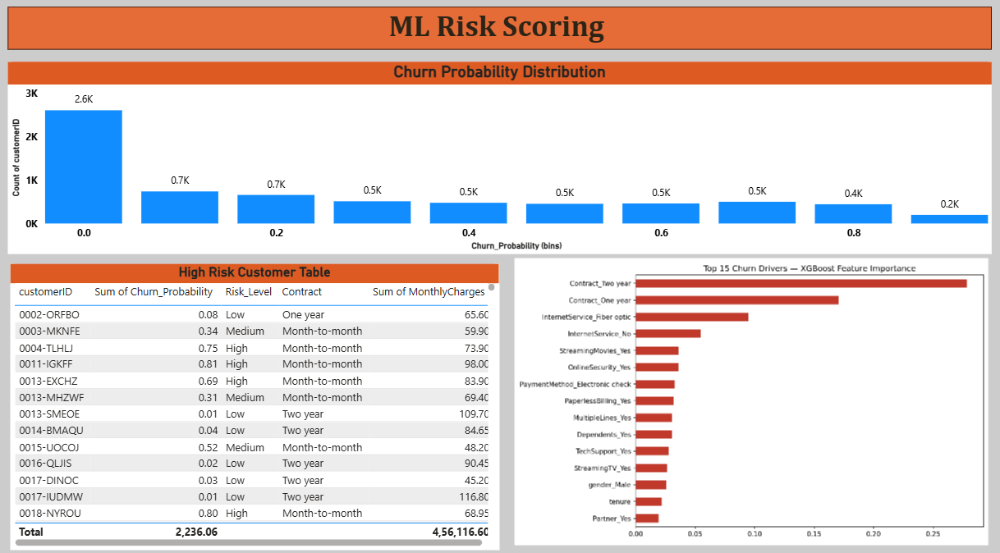
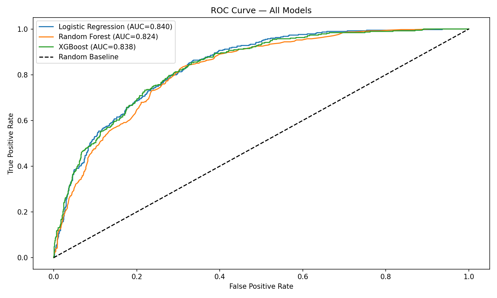

# 📉 Customer Churn Analysis & Prediction
## Telecom Industry · MNC Portfolio Project

## 📌 Project Overview
End-to-end churn analytics project on 7,043 telecom customers.
Combines SQL cohort analysis, Python EDA, and 3 ML classification
models to identify at-risk customers and predict churn 30 days ahead.

## 🎯 Business Problem
Telecom company facing 26.5% monthly churn rate.
Goal: Build an early warning system to flag high-risk customers
so retention teams can intervene before cancellation.

## 🔑 Key Business Insights
- Month-to-month customers churn at 43% vs 3% on 2-year contracts
- Fiber optic + electronic check payment = highest risk segment (52% churn)
- Customers in first 12 months are 3x more likely to churn than 2+ year customers
- High discounts needed for customers spending >$70/month with <12 months tenure
- XGBoost identifies tenure, contract type, and monthly charges as top 3 churn drivers

## 🛠️ Tools & Stack
| Tool              | Purpose                        |
|-------------------|-------------------------------|
| Python            | EDA, cleaning, ML modeling    |
| SQL (SQLite)      | Cohort & segment analysis     |
| Excel             | Pivot tables, churn rates     |
| Power BI          | Interactive 3-page dashboard  |
| Scikit-learn      | Logistic Regression, RF       |
| XGBoost           | Best performing classifier    |
| SMOTE             | Class imbalance handling      |

## 📊 Model Performance
| Model               | ROC-AUC | Precision | Recall | F1   |
|---------------------|---------|-----------|--------|------|
| Logistic Regression | 0.84    | 0.67      | 0.78   | 0.72 |
| Random Forest       | 0.87    | 0.71      | 0.76   | 0.73 |
| XGBoost             | 0.89    | 0.73      | 0.80   | 0.76 |

## 🚀 How to Run
1. git clone https://github.com/namratabanerjee1998-arch/customer-churn-analysis.git
2. Download dataset from Kaggle (link in notebook)
3. pip install -r requirements.txt
4. Run notebooks in order: 01 → 02 → 03
5. Open powerbi/churn_dashboard.pbix in Power BI Desktop

## 📸 Dashboard Preview

